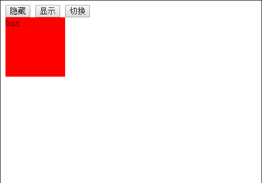

## 1.显示和隐藏 ##

	$('.hide').click(function(event) {
		$('#box').hide('1000', function() {
			alert('隐藏完毕');
		});
	});

	$('.show').click(function(event) {
		$('#box').show('slow', function() {
			alert('显示完毕');
		});	
	});
	$('.qiehuan').click(function(event) {
		$('#box').toggle('slow');
	});

效果   

列队动画

	//列队动画
	$('.show').click(function(event) {
		$('.test').first().show('fast', function testshow() {
			$(this).next().show('fast', testshow);
		});
	});
	$('.hide').click(function(event) {
		$('.test').last().hide('fast', function testshow() {
			$(this).prev().hide('fast',testshow);
		});
	});

效果   

## 2.滑动卷动 ##

	$('.up').click(function(event) {
		$('#box').slideUp('fast');
	});
	$('.down').click(function(event) {
		$('#box').slideDown('fast');
	});
	$('.qh').click(function(event) {
		$('#box').slideToggle('slow');
	});

效果   

## 3.淡入淡出 ##

	$('.in').click(function(event) {
		$('#box').fadeIn('slow');
	});
	$('.out').click(function(event) {
		$('#box').fadeOut('slow');
	});
	$('.io').click(function(event) {
		$('#box').fadeToggle('slow');
	});
	$('.to').click(function(event) {
		$('#box').fadeTo('slow', 0.5);
	});

效果

## 4.自定义动画 ##

	$('.my').click(function(event) {
		$('#box').animate({
			width: '300px',
			height: '200px',
            opacity:0.5,
            fontsize:'50px'
		},
			1000, function() {
			alert('动画完毕');
		});
	});

效果图

	$('.my').click(function(event) {
		$('#box').animate({
			left: '300px',
			top: '200px'
		}, 'slow');
	});

效果

在原来的基础上运动

	$('.my').click(function(event) {
		$('#box').animate({
			left:'+=50px'
		}, 'slow');
	});

列队动画

	// 列队动画
	$('.my').click(function(event) {
		$('#box').animate({
			width:'200px'
		},function(){
			$('#box').animate({
				height:'300px'
			},function(){
				$('#box').animate({
					opacity:0.5
				},function(){
					$('#box').animate({
						fontSize:'50px'
					},function(){
						alert('动画完毕');
					});
				});
			});
		});
	});

效果

也可以通过连缀方法实现

	//连缀方法实现，列队动画
	$('.my').click(function(event) {
		$('#box').animate({width:'200px'})
		         .animate({height:'300px'})
		         .animate({opacity:0.5})
		         .animate({fontSize:'50px'});
	});

## 5.列队动画方法 ##
使用.queue()方法模拟动画方法跟随动画方法之后

	$('.my').click(function(){
		$('#box').slideUp('slow')
				.slideDown('slow')
				.queue(function(next){
					$(this).css('background-color', 'orange');
					next();
				}).hide('slow');
	});

## 6.动画相关方法 ##

	$('.start').click(function(event) {
		$('#box').animate({
			left:'300px'
		},4000);
	});
	$('.stop').click(function(event) {
		$('#box').stop();
	});

如果有列队动画，按停止的话，会停止当前列队，继续执行下一个列队。

	$('.stop').click(function(event) {
		$('#box').stop();
	});
	$('.start').click(function(event) {
		$('#box').animate({left:'1200px'},4000)
				.animate({top:'400px'},4000)
				.animate({width:'300px'},4000)
				.animate({height:'300px'},4000)
	});

效果

jquery提供了一个延迟动画的方法

	$('.start').click(function(event) {
		$('#box').animate({left:'1200px'},4000).delay(1000)
				.animate({top:'400px'},4000)
				.animate({width:'300px'},4000)
				.animate({height:'300px'},4000)
	});

## 7.动画全局属性 ##
在animate()方法中，还有一个参数，easing运动方式，swing(缓动) linear(匀速)

	$('.start').click(function(){
		$('#box').animate({
			left:'400px'
		},'slow','swing');
		$('#pox').animate({
			left:'400px'
		},'slow','linear');
	});

